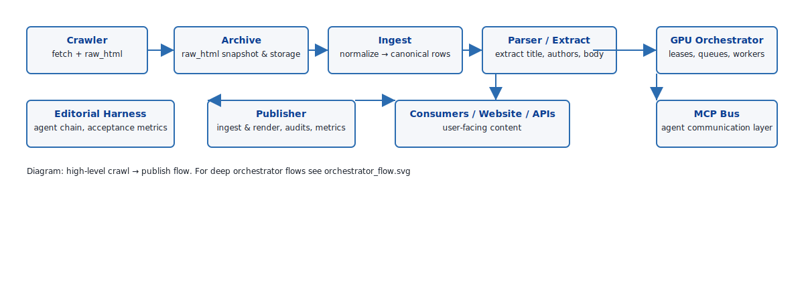
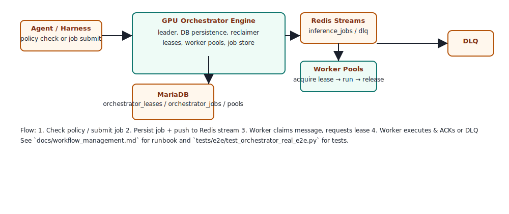

# JustNews — Technical Architecture (canonical)

This document is the canonical, single-file architectural overview for the JustNews system. It synthesizes the high-level design and maps ongoing implementation/status work so teams can quickly find the right subsystem documentation and current progress.

Purpose:
- Provide a single concise system diagram + component responsibilities
- Surface the current implementation status for each major area (so progress can be tracked)
- Link to authoritative subsystem docs and tests for deeper detail

Audience: architects, engineers, operators and program managers working across the project.

---

## 1. System overview

JustNews is a distributed, multi-agent news analysis platform with strong separation of concerns:

- Crawling & fetch (scalable fetchers, raw HTML snapshotting)
- Archive & ingestion (raw_html persistence, normalization into canonical records)
- Parsing & extraction (content structuring, metadata extraction)
- Reasoning & editorial agent chain (agent-driven editorial reasoning, fact-checking, synthesizer)
- Publishing (lightweight publisher application and ingestion for produced articles)
- Orchestration (GPU Orchestrator for resource leasing and job queues)
- Observability & monitoring (Prometheus, Grafana dashboards, traces, alerts)
- Training & model store (ModelStore and training pipelines)

Data & control plane:
- Data flows: crawl -> archive/raw_html -> ingest -> normalized rows -> editorial harness -> publish
- Control plane: MCP Bus + orchestrator + job queues and admin endpoints

High-level diagram (visual):

GPU & Model compute: Editorial & other agents request orchestration (policy/leases) or submit jobs -> agents/gpu_orchestrator -> worker pools (Redis Streams)

---

## 2. Important repository landing pages (authoritative)
- Repo-level: `README.md` (root) — quick start and high-level summary
- Canonical docs index: `docs/README.md` — documentation catalogue and navigator
- System status / program-level plan: `COMPREHENSIVE_REFACTORING_ANALYSIS.md` — high-level refactor/program progress
- Live-run E2E plan: `docs/live-run-plan.md` — staged end-to-end plan for crawl -> publish validation
- Orchestrator design & runbook: `docs/workflow_management.md` — persistent orchestration & job lifecycle (GPU Orchestrator)
- Editorial ↔ Orchestrator crosswalk: `docs/editorial-orchestrator-crosswalk.md`

These files should be consulted in combination to get both the operational roadmap and the detailed subsystem specifications.

---

## 3. Component responsibilities & implementation status
Status legend:
- ✅ Completed
- 🟢 Production-ready / well-instrumented
- 🟡 In-progress / partially implemented
- ⚠️ Outstanding / requires work

For each major component below we show: short description, current status, evidence (file/tests), and suggested next actions.

### 3.1 Crawling & fetch
- Description: crawler agents fetch pages and store raw HTML snapshots and extraction metadata.
- Status: 🟢 Implemented - robust fetchers + raw_html persistence
- Evidence: `agents/crawler/`, `agents/crawler/extraction.py`, `scripts/dev/canary_urls.txt`
- Next steps: periodic canary verification dashboards and ingest gating automation.

### 3.2 Archive & Ingestion
- Description: ensure raw_html snapshots are kept and ingestion converts snapshots to normalized records.
- Status: 🟢 Implemented with observability & CI verification — pipeline exists with tests; Grafana wiring and canary CI are in place, DB visibility gating for some operators remains.
- Evidence: `agents/archive/ingest_pipeline.py`, `agents/archive/raw_html_snapshot.py`, tests `tests/agents/test_archive_ingest_pipeline.py`, `monitoring/dashboards/generated/ingest_archive_dashboard.json`, `monitoring/alerts/ingest_pipeline_rules.yml`, `.github/workflows/canary-refresh.yml`, `.github/workflows/canary-pr.yml`.
- Next steps: finish DB visibility gating for dev → pre-prod promotion, tune alert thresholds using historical canary runs, and expand fixture coverage for edge cases.

### 3.3 Parsing & Extraction
- Description: content extraction and structured field extraction. The crawler prefers a Crawl4AI-first strategy for profile-driven crawls (adaptive, model-assisted extraction) while `agents/crawler/extraction.py` (Trafilatura -> Readability -> jusText cascade) remains available as the robust fallback for generic site extraction.
 - Status: 🟢 Implemented — deterministic canary fixtures are exercised in CI (PR-level & nightly canary runs) and crawl/profile paths exercise both Crawl4AI and Trafilatura fallbacks; the extractor pipeline consistently emits cleaned_text and structured metadata in production runs and CI validation.
 - Evidence: `agents/crawler/crawl4ai_adapter.py`, `agents/crawler/crawler_engine.py` (crawl4ai-first profile selection), `agents/crawler/extraction.py` (Trafilatura-based fallback extractor), `tests/parsing/test_canary_articles.py`, `tests/fixtures/canary_articles/`, `.github/workflows/canary-pr.yml`, `.github/workflows/canary-refresh.yml`, `monitoring/dashboards/generated/ingest_archive_dashboard.json`.
 - Next steps: maintain parity tests and incrementally expand fixture coverage for targeted edge-cases; continue to instrument extraction quality via canary KPIs and tune site profiles if extraction drops under configured thresholds.

### 3.4 HITL service / Editor label flows
- Description: human-in-the-loop labeling and ingest-enqueue behavior between crawler → ingest → editorial harness.
- Status: 🟢 Implemented with metrics & UI
- Evidence: `agents/hitl_service/app.py`, `agents/hitl_service/README.md`, frontend static files and metric hooks
- Next steps: ensure integrations are fully reflected in Grafana and add DB gating checks for ingest enqueues.

### 3.5 Editorial harness & reasoning agents
- Description: agent chain that reads normalized articles and outputs drafts with acceptance/followup checks.
 - Status: 🟢 Implemented — editorial harness and reasoning agents are integrated with normalized rows, publish paths, and regression tests; CI exercises harness dry-run & publish paths in PR-level checks and nightly validations.
 - Evidence: `agents/common/editorial_harness_runner.py`, `scripts/dev/run_agent_chain_harness.py`, tests under `tests/agents/common/`, `.github/workflows/editorial-harness.yml`, `tests/e2e/test_publisher_publish_flow.py`.
 - Next steps: keep improving metrics & audit logs; finalize operator playbooks for incident handling and performance tuning.

### 3.6 Publisher application (lightweight)
- Description: Django-based publisher for vetting, storing and rendering published articles; exposes metrics & audit API.
- Status: 🟢 Implemented and covered by e2e tests
- Evidence: `agents/publisher/` (manage.py, models, views), `tests/e2e/test_publisher_publish_flow.py`, `docs/grafana/publisher-dashboard.json`
- Next steps: harden auth/approval flows for production, extend audit logs and ingest validation.

### 3.7 GPU Orchestrator and worker pools
- Description: persistent orchestrator that manages leases, worker pools, Redis Streams, reclaimer and DLQ for GPU-bound jobs.
 - Status: 🟢 Production-ready — core orchestrator features (leases, worker pools, lease reclaimer, DLQ handling) are implemented and covered by tests and CI-convergent e2e runs. Monitoring and alerts are wired to observability dashboards.
 - Evidence: `agents/gpu_orchestrator/*` (`main.py`, `gpu_orchestrator_engine.py`, `worker.py`, `job_consumer.py`), tests `tests/e2e/test_orchestrator_real_e2e.py`, monitoring alert rules `monitoring/alerts/gpu_orchestrator_*.yml`, `docs/workflow_management.md`, and CI pipelines that exercise orchestrator integration flows.
 - Next steps: continue production hardening with red-team drills, soak tests, and finalize Redis XAUTOCLAIM tuning as part of ongoing operational maintenance.
 
 

### 3.8 Observability & Monitoring
- Description: Prometheus metrics, Grafana dashboards, alerts, traces and dashboards for editorial harness, publisher and orchestrator.
- Status: 🟢 Foundations implemented and Stage 1/2 telemetry wired — dashboards and basic alerting are in place and CI can exercise the end-to-end canary.
- Evidence: `docs/grafana/editorial-harness-dashboard.json`, `docs/grafana/publisher-dashboard.json`, `monitoring/dashboards/generated/system_overview_dashboard.json`, `monitoring/dashboards/generated/ingest_archive_dashboard.json`, `monitoring/alerts/ingest_pipeline_rules.yml`, `monitoring/alerts/*`.
- Next steps: tune the ingest/raw_html alert thresholds using historical canary runs, include the new alert rules in Prometheus/Alertmanager provisioning, and add an on-call runbook for these alerts.

### 3.9 Deployment & CI/CD
- Description: systemd-first deployments, CI workflows, release & packaging pipelines, docs-driven checks.
- Status: 🟢 Implemented; CI workflows present and extended to include diagram rendering and canary validation
- Evidence: `infrastructure/systemd/*`, `Makefile`, `.github/workflows/*` (including `.github/workflows/diagrams-ci.yml`, `.github/workflows/canary-refresh.yml`, `.github/workflows/canary-pr.yml`), `COMPREHENSIVE_REFACTORING_ANALYSIS.md`.
- Next steps: finalize release automation for orchestrator and publisher; promote PR-level canary checks to required branch protections and tie nightly canary KPI results to release gating where appropriate.

### 3.10 Configuration, Security & Compliance
- Description: Pydantic v2 centralized config, auth, RBAC and GDPR notes
- Status: 🟢 Implemented, audited
- Evidence: `config/`, `COMPREHENSIVE_REFACTORING_ANALYSIS.md`, `security/` and `docs/`
- Next steps: continued audits and operational checks.

### 3.11 Testing & quality
- Description: unit, integration & gated E2E tests (with opt-in GPU tests)
- Status: 🟢 Substantially implemented
- Evidence: `tests/` (unit/integration/e2e), `pytest.ini`, gating environment flags in `live-run-plan.md`
- Next steps: close remaining test failures and improve canary coverage.

---

## 4. How to read / maintain this doc
- This file should be the canonical, short system architecture view. For deep dives, consult subsystem docs listed at the top.
- Implementation status should be updated as part of PRs that change subsystem readiness. Suggested pattern: update the status legend entry and add a short “last_updated” note in the block.

Recommended status workflow:
1. Small change → subsystem doc + tests updated → PR updates this document (status & evidence) or the subsystem doc directly.
2. Larger milestones (e.g., production hardening) → update `COMPREHENSIVE_REFACTORING_ANALYSIS.md` and the subsystem page and add a short paragraph here.

---

## 5. Immediate priorities (coordination)
- Finalize GPU Orchestrator production hardening (reclaimer XCLAIM/XAUTOCLAIM semantics, idempotency tests, soak tests) and operator playbooks.
- Expand deterministic parsing fixtures for author and publish-date edge cases and add unit/integration tests.
- Promote PR-level canary checks to branch protection (fast feedback) and wire nightly canary KPI results into release gating and alerts once thresholds are validated.

---

If you want I can:
- Create an automated check that validates this doc's status blocks against tests/coverage (CI gating), or
- Draft a one-page operations runbook adapted from `workflow_management.md` for operator drills (evict/pause/drain), or
- Add a diagram (SVG/Mermaid) and link into `docs/README.md` and root `README.md`.

Additionally, for staging and release validation, there is a step-by-step E2E staging checklist and a small helper smoke-run script:

- `docs/staging/E2E_STAGING_CHECKLIST.md` — step-by-step runbook to validate crawl → HITL → editorial → publish, training, and KG ingestion in a staging environment.
- `scripts/dev/staging_run_smoke.sh` — lightweight operator helper script to run a constrained smoke validation of core flows in a staging env.
